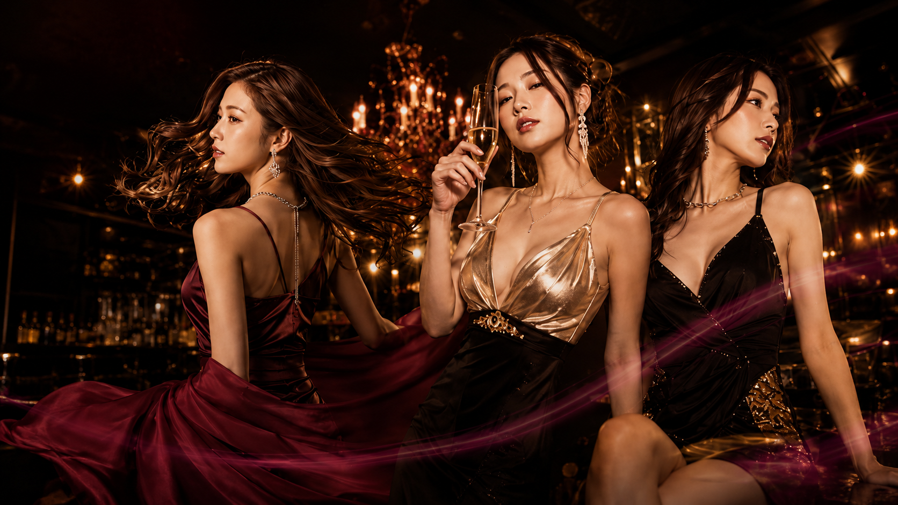
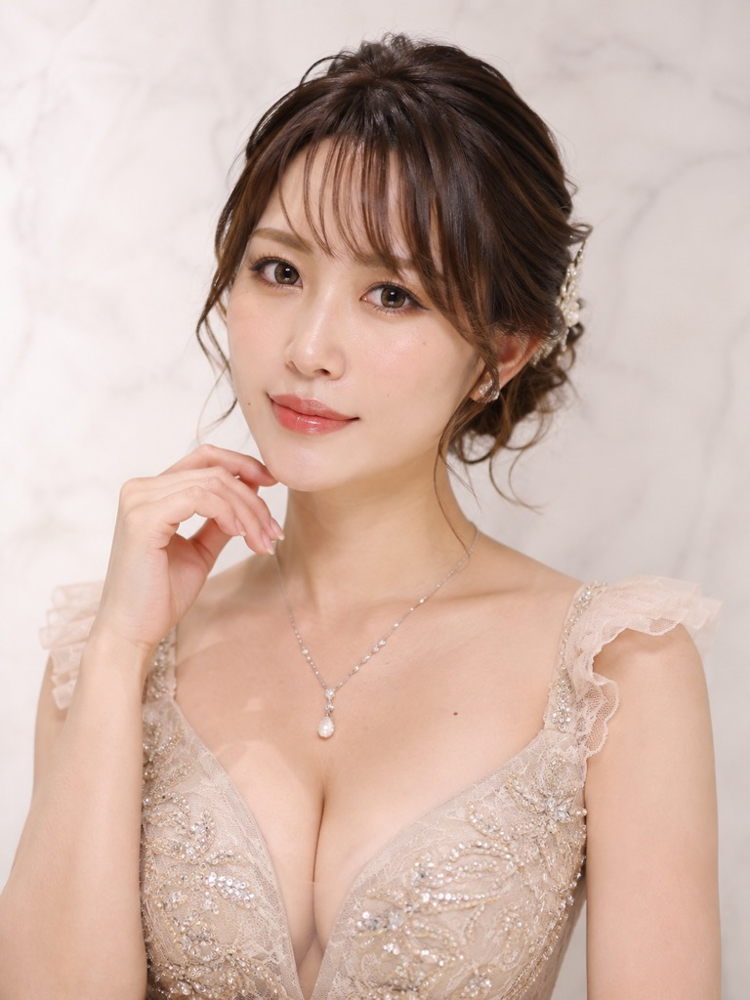
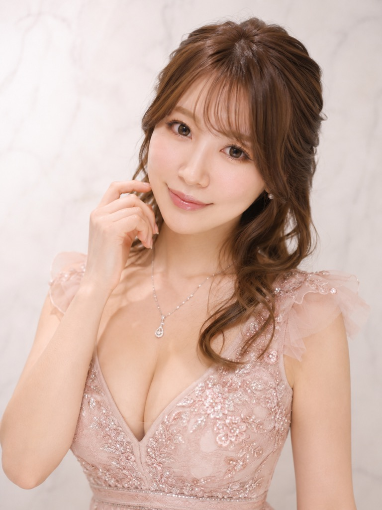
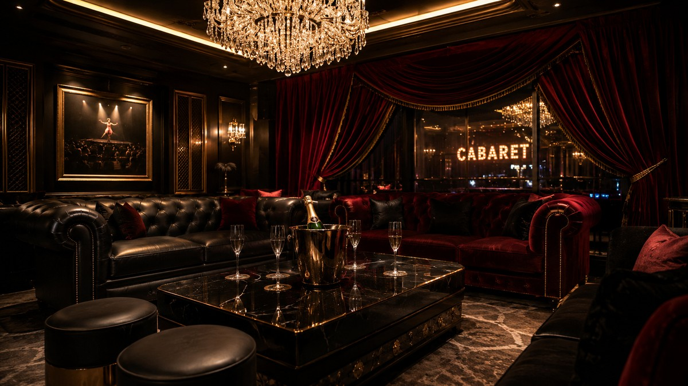

# 画像マップ（どのページのどこに・どの画像が入るか）

> ファイルは全部この `images/` フォルダ直下に、下の**ファイル名のまま**置けば反映される。
> 下に出てる画像は今入っている「仮のAI画像」。社長の本番画像で同名上書きすればそこに入る。

---

## ■ index.html（TOPページ＝参考画像のページ）

### HERO（最上部のメインビジュアル）
`hero.png` — 1920×1080 / 16:9 横

### CAST カード（3枚サムネ）
`cast-01.jpg` ／ `cast-02.jpg` ／ `cast-03.jpg` — 各 768×1024 / 3:4 縦

  

### SYSTEM カード
`lounge.jpg` — 1200×675 / 16:9 横

### NEWS カード
画像なし（テキストのみ）

---

## ■ cast.html（CAST一覧＝8名）

| 枠 | 名前 | ファイル名 | 画像 |
|---|---|---|---|
| ① | 玲奈 Rena | `cast-01.jpg` |  |
| ② | 美咲 Misaki | `cast-02.jpg` |  |
| ③ | 彩花 Ayaka | `cast-03.jpg` |  |
| ④ | 凛 Rin | `cast-04.jpg` | （未・要用意） |
| ⑤ | 沙耶 Saya | `cast-05.jpg` | （未・要用意） |
| ⑥ | 麗 Urara | `cast-06.jpg` | （未・要用意） |
| ⑦ | ひな Hina | `cast-07.jpg` | （未・要用意） |
| ⑧ | 琴音 Kotone | `cast-08.jpg` | （未・要用意） |

各 768×1024 / 3:4 縦。

---

## ■ cast-detail.html（CAST詳細・玲奈）
`cast-01.jpg`（メイン大）＋ `cast-02.jpg` `cast-03.jpg`（下のサムネ）を流用。**追加画像なし**。

---

## ■ system.html（料金）
画像なし（表のみ）。

---

## ■ schedule.html（出勤表）
本日出勤カードに `cast-01〜04.jpg` を流用。**追加画像なし**。

---

## ■ gallery.html（ギャラリー）
`hero.png` `lounge.jpg` `cast-01〜03.jpg` を流用してタイル表示。**追加画像なし**。
（専用のギャラリー写真を増やしたい場合だけ別途指示を）

---

## ■ news.html / news-detail.html
一覧は画像なし。詳細の記事トップに `hero.png` を流用。**追加画像なし**。

---

## ■ access.html（アクセス）
写真なし（Googleマップ埋め込みのみ）。

---

## ■ reserve.html / recruit.html / privacy.html / legal.html
写真なし。

---

# まとめ：社長が用意する画像は **この10枚だけ**

| ファイル名（images/直下に置く） | サイズ | 比率 |
|---|---|---|
| `hero.png` | 1920×1080 | 16:9 |
| `cast-01.jpg` 〜 `cast-08.jpg`（8枚） | 768×1024 | 3:4 |
| `lounge.jpg` | 1200×675 | 16:9 |

任意（無くても動く）：`logo.png`（金のAエンブレム・透過）／`favicon.png`／`ogp.jpg`
